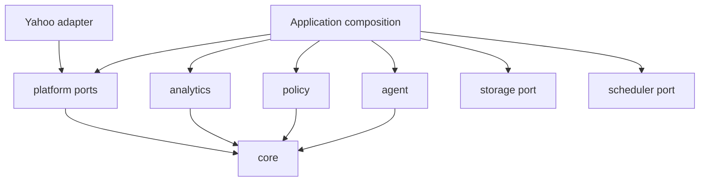

# EggBot architecture

## Goals

EggBot is a reusable, provider-independent framework for safe fantasy-football automation. Its public boundaries make dependencies explicit, keep decisions inspectable, and reserve side effects for concrete platform adapters. Phase 0 establishes those boundaries without choosing a league format, model provider, database, scheduler, or deployment environment.

## Workspace layout

| Workspace           | Responsibility                                             | Direct workspace dependencies |
| ------------------- | ---------------------------------------------------------- | ----------------------------- |
| `@eggbot/core`      | Stable domain vocabulary, opaque IDs, actions, and results | None                          |
| `@eggbot/platform`  | Provider-neutral read and execution ports                  | `core`                        |
| `@eggbot/yahoo`     | Yahoo adapter boundary and discovery metadata              | `platform`                    |
| `@eggbot/agent`     | Provider-neutral decision-engine port                      | `core`                        |
| `@eggbot/policy`    | Deterministic approval/rejection boundary                  | `core`                        |
| `@eggbot/analytics` | Deterministic calculations and analytics port              | `core`                        |
| `@eggbot/storage`   | Persistence port, with no implementation                   | None                          |
| `@eggbot/scheduler` | Scheduling port, with no implementation                    | None                          |
| `@eggbot/cli`       | Application composition proof                              | Public APIs of all packages   |

Packages expose a single explicit root entry point. Deep imports are not part of the public API. TypeScript project references and pnpm workspace links enforce an acyclic build graph.



## Domain and platform separation

`@eggbot/core` owns EggBot's vocabulary. Platform payloads and identifiers must be validated and mapped at adapter boundaries; they must not become the core model. Opaque EggBot IDs prevent accidental interchange of league, team, player, slot, decision, and action identifiers. `PlatformReference` exists only to explicitly associate an external identity when a boundary needs one.

The platform contract separates `FantasyPlatformReader` from `FantasyPlatformExecutor`. Read-only applications therefore need no write authority. Concrete adapters return core types and translate `FantasyAction` data into provider operations internally.

The Yahoo package currently exports metadata declaring both capabilities unavailable. OAuth, HTTP, parsing, mapping, and execution are deferred to the relevant roadmap phases.

## Decision and execution separation

State flows inward as normalized data; intent flows outward as inspectable actions:

```text
platform reads -> EggBot domain -> deterministic analytics -> decision proposal
decision proposal -> policy evaluation -> approved actions -> platform executor
```

A `DecisionEngine` receives domain context and analytics, not credentials or an executor. It returns a `FantasyDecision` containing rationale and proposed actions. Creating either object has no side effect. The policy engine evaluates every proposed action and returns an explicit approved or rejected result. Only an application composition root may pass approved actions to an executor.

`ActionResult` records either successful execution metadata or an actionable failure. A later orchestration layer can add lifecycle persistence, retries, reconciliation, and dry runs without collapsing proposal, approval, and execution into one operation.

## Analytics philosophy

Deterministic facts belong in code. Decision engines may reason over those facts, but should not be asked to reproduce calculations that can be tested directly. Phase 0 includes only projected-lineup summation as a boundary proof; broader metrics begin in Phase 4.

## Configuration and extension points

Applications are composition roots. They will construct and inject:

- fantasy-platform readers and executors
- decision engines
- policy rules or engines
- analytics providers
- storage adapters
- schedulers

Library code does not read environment variables, create singleton clients, or select concrete providers. Future platform and model integrations should use separate packages that implement these public ports.

## Error and validation philosophy

External values are validated at system boundaries; Phase 0 ID constructors use Zod for this purpose. Adapters should retain provider context while translating authentication, validation, transport, and API failures into actionable errors. Policy rejection remains a normal typed result, not an exception. A larger custom error hierarchy is intentionally deferred until real integrations demonstrate the distinctions needed.

## Eventual open-source considerations

Public exports are intentionally small and package-scoped for eventual semantic versioning. Provider payloads and implementation helpers remain internal. Normal tests require no credentials or live services. Future provider integration tests must be opt-in and separated from deterministic unit tests. Package READMEs document responsibility so contributors can extend the system without introducing circular dependencies or leaking concrete providers into stable abstractions.

## Phase 0 deviations

The instructed package boundaries are retained. The only interpretation choices are conservative: no build orchestrator is added for this small workspace; ESLint uses its current flat configuration; Yahoo exposes metadata rather than a throwing adapter; and storage, scheduler, and most analytics capabilities remain ports instead of placeholder implementations. These choices reduce speculative code while preserving every planned extension seam.
