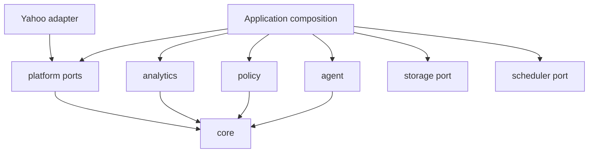

# EggBot architecture

## Goals

EggBot is a reusable, provider-independent framework for safe fantasy-football automation. Its public boundaries make dependencies explicit, keep decisions inspectable, and reserve side effects for concrete platform adapters. Phase 0 established those boundaries without choosing a league format, model provider, database, scheduler, or deployment environment. Phase 1 supplies the first read-only adapter without weakening them.

## Workspace layout

| Workspace           | Responsibility                                             | Direct workspace dependencies |
| ------------------- | ---------------------------------------------------------- | ----------------------------- |
| `@eggbot/core`      | Stable domain vocabulary, opaque IDs, actions, and results | None                          |
| `@eggbot/platform`  | Provider-neutral read and execution ports                  | `core`                        |
| `@eggbot/yahoo`     | Yahoo OAuth, read transport, validation, and mapping       | `core`, `platform`            |
| `@eggbot/agent`     | Provider-neutral decision-engine port                      | `core`                        |
| `@eggbot/policy`    | Deterministic approval/rejection boundary                  | `core`                        |
| `@eggbot/analytics` | Deterministic calculations and analytics port              | `core`                        |
| `@eggbot/storage`   | Persistence port, with no implementation                   | None                          |
| `@eggbot/scheduler` | Scheduling port, with no implementation                    | None                          |
| `@eggbot/cli`       | Application composition proof                              | Public APIs of all packages   |

Packages expose a single explicit root entry point. Deep imports are not part of the public API. TypeScript project references and pnpm workspace links enforce an acyclic build graph.



## Domain and platform separation

`@eggbot/core` owns EggBot's vocabulary. Platform payloads and identifiers must be validated and mapped at adapter boundaries; they must not become the core model. Opaque EggBot IDs prevent accidental interchange of league, team, player, slot, decision, action, and transaction identifiers. `PlatformReference` exists only to explicitly associate an external identity when a boundary needs one.

The platform contract separates `FantasyPlatformReader` from `FantasyPlatformExecutor`. Read-only applications therefore need no write authority. Concrete adapters return core types and translate `FantasyAction` data into provider operations internally.

The Yahoo package implements the Phase 1 read capability. OAuth, token refresh, HTTP transport, response validation, Yahoo identifier codecs, and mappings remain inside the adapter. Yahoo write execution remains unavailable and is deferred to Phase 2.

## Phase 1 public API additions

Yahoo read integration exposed concrete omissions in the Phase 0 contracts. These are additive changes; no existing method or type is removed or reinterpreted.

- Core adds `Standing`, `Transaction`, `TransactionMove`, and `TransactionId`. Standings and transaction history are provider-independent league facts explicitly required by Phase 1, but Phase 0 had no normalized vocabulary for them.
- Platform adds `FantasyGame`, `LeagueSummary`, `TransactionQuery`, explicit player availability, and reader methods for authenticated game/league discovery, standings, and transactions. Yahoo cannot implement the required reads through the original six reader methods.
- `getRoster` remains the current roster read. Yahoo's week-specific roster representation is used by the existing `getLineup(teamId, scoringPeriod)` method, so no Yahoo week selector leaks into the general platform API.

Yahoo's irregular JSON collection encoding, resource keys, pagination limits, OAuth token shape, and week endpoint syntax remain adapter-local.

## Yahoo OAuth and read transport

`YahooOAuthClient` implements Yahoo's authorization-code exchange and proactive access-token refresh. Callers inject an optional `YahooTokenStore`; this keeps token persistence out of the adapter while ensuring refresh-token rotation can be saved. Concurrent callers share one refresh request. Client credentials and tokens never enter domain objects.

`YahooHttpClient` accepts only relative Fantasy API paths, adds the JSON format selector and Bearer token, and retries a GET once after a 401 using a forced refresh. It does not expose arbitrary methods and cannot issue writes. Successful responses must contain Yahoo's `fantasy_content` envelope before reaching resource mappers.

`YahooFantasyReader` builds Yahoo-specific resource and collection URLs, performs pagination, and maps the validated boundary data into public EggBot types. Player availability maps explicitly to Yahoo's available, free-agent, or waiver filters. Multi-position queries fan out into provider-specific calls and deduplicate normalized players rather than silently ignoring requested positions.

The CLI is the only code that reads Yahoo environment variables. For developer use, it stores tokens in a gitignored local file with owner-only permissions. Library token persistence remains injected. Normal CLI output always redacts OAuth secrets unless the user explicitly requests `--show-secrets` during code exchange.

Unit tests inject `fetch`, a clock, and token stores. Normal tests use representative JSON fixtures and never require Yahoo credentials or network access.

Policy evaluation is action-scoped: every proposed action has its own approved/rejected result and complete issue list. A mixed decision has no ambiguous aggregate status. Orchestration explicitly derives approved actions before any future executor receives them.

## Deferred hardening decisions

- Expand `LeagueSettings` only when snapshot, waiver, trade, playoff, lock, IR, and keeper use cases establish provider-independent requirements; do not mirror Yahoo's settings payload.
- Keep `PlatformReference` and `FantasyGame.platformReference` until a second adapter provides evidence for a shared `GameId` design.
- Keep Yahoo's recursive collection traversal while sanitized fixtures and the opt-in live suite validate actual responses. Replace it with context-specific traversal if real payloads reveal duplicates or ambiguous nesting.
- Further constrain injectable Yahoo base URLs if transports become consumer-configurable outside tests. Current API paths are generated internally and explicit absolute paths are rejected.

## Decision and execution separation

State flows inward as normalized data; intent flows outward as inspectable actions:

```text
platform reads -> EggBot domain -> deterministic analytics -> decision proposal
decision proposal -> policy evaluation -> approved actions -> platform executor
```

A `DecisionEngine` receives domain context and analytics, not credentials or an executor. It returns a `FantasyDecision` containing rationale and proposed actions. Creating either object has no side effect. The policy engine evaluates every proposed action and returns an explicit approved or rejected result. Only an application composition root may pass approved actions to an executor.

`ActionResult` records either successful execution metadata or an actionable failure. A later orchestration layer can add lifecycle persistence, retries, reconciliation, and dry runs without collapsing proposal, approval, and execution into one operation.

## Analytics philosophy

Deterministic facts belong in code. Decision engines may reason over those facts, but should not be asked to reproduce calculations that can be tested directly. Phase 0 includes only projected-lineup summation as a boundary proof; broader metrics begin in Phase 4.

## Configuration and extension points

Applications are composition roots. They will construct and inject:

- fantasy-platform readers and executors
- decision engines
- policy rules or engines
- analytics providers
- storage adapters
- schedulers

Library code does not read environment variables, create singleton clients, or select concrete providers. Future platform and model integrations should use separate packages that implement these public ports.

## Error and validation philosophy

External values are validated at system boundaries; Phase 0 ID constructors use Zod for this purpose. Adapters should retain provider context while translating authentication, validation, transport, and API failures into actionable errors. Policy rejection remains a normal typed result, not an exception. A larger custom error hierarchy is intentionally deferred until real integrations demonstrate the distinctions needed.

## Eventual open-source considerations

Public exports are intentionally small and package-scoped for eventual semantic versioning. Provider payloads and implementation helpers remain internal. Normal tests require no credentials or live services. Future provider integration tests must be opt-in and separated from deterministic unit tests. Package READMEs document responsibility so contributors can extend the system without introducing circular dependencies or leaking concrete providers into stable abstractions.

## Phase 0 deviations

The instructed package boundaries are retained. The only interpretation choices are conservative: no build orchestrator is added for this small workspace; ESLint uses its current flat configuration; Yahoo exposes metadata rather than a throwing adapter; and storage, scheduler, and most analytics capabilities remain ports instead of placeholder implementations. These choices reduce speculative code while preserving every planned extension seam.
