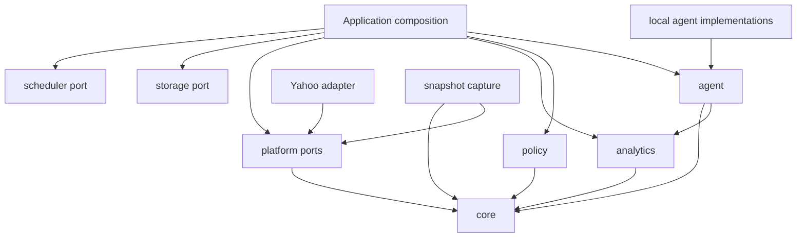

# EggBot architecture

## Goals

EggBot is a reusable, provider-independent framework for safe fantasy-football automation. Its public boundaries make dependencies explicit, keep decisions inspectable, and reserve side effects for concrete platform adapters. Phases 0 through 5 establish the shared boundaries, Yahoo adapter, guarded execution, normalized snapshots, deterministic analytics, and audited decision-engine execution without choosing a league format, model provider, database, scheduler, or deployment environment.

## Workspace layout

| Workspace             | Responsibility                                             | Direct workspace dependencies |
| --------------------- | ---------------------------------------------------------- | ----------------------------- |
| `@eggbot/core`        | Stable domain vocabulary, opaque IDs, actions, and results | None                          |
| `@eggbot/platform`    | Provider-neutral read and execution ports                  | `core`                        |
| `@eggbot/yahoo`       | Yahoo OAuth, read transport, validation, and mapping       | `core`, `platform`            |
| `@eggbot/snapshot`    | Normalized multi-read league snapshot capture              | `core`, `platform`            |
| `@eggbot/agent`       | Provider-neutral decision-engine port                      | `core`, `analytics`           |
| `@eggbot/agent-local` | Safe local decision-engine implementations                 | `agent`                       |
| `@eggbot/policy`      | Deterministic approval/rejection boundary                  | `core`                        |
| `@eggbot/analytics`   | Deterministic calculations and analytics port              | `core`                        |
| `@eggbot/storage`     | Persistence port, with no implementation                   | None                          |
| `@eggbot/scheduler`   | Scheduling port, with no implementation                    | None                          |
| `@eggbot/cli`         | Application composition proof                              | Public APIs of all packages   |

Packages expose a single explicit root entry point. Deep imports are not part of the public API. TypeScript project references and pnpm workspace links enforce an acyclic build graph.



## Phase 5 public API changes

The original `DecisionEngine.decide()` returned a complete `FantasyDecision`. That allowed an engine—including a future external model adapter—to choose audit timestamps, decision identifiers, and action idempotency keys, and there was no standard boundary validating rationale, league/team scope, or lineup scoring period. Calling the engine also produced no record connecting its identity and version to the source snapshot and exact analytics.

Phase 5 changes engine output to a `DecisionProposal`: rationale plus inspectable action intents, but no decision or action identities and no audit timestamps. `runDecisionEngine` validates the context and proposal, assigns decision and action IDs plus timestamps through injected application-owned functions, and returns a `DecisionRun` that records engine identity, source snapshot, managed team, exact analytics, timing, and the resulting `FantasyDecision`. Proposal validation rebuilds every action and lineup assignment from an explicit field allowlist and passes every identifier through the core branded-ID parsers; unknown model-supplied fields cannot flow into policy, fingerprints, audit records, or executors. Generated action IDs must be non-empty and unique within the decision. Invalid output fails closed with a typed `DecisionValidationError`; provider failures remain provider failures rather than being mislabeled as validation errors.

`@eggbot/agent-local` is the first separate implementation package. It provides a safe no-action engine and an injected-function adapter for deterministic, human-mediated, or test-local decision logic. It has no platform reader, executor, credentials, network client, or model SDK. Concrete model-provider packages remain deferred until a provider is deliberately selected; they can implement the same `DecisionEngine` port without changing core or receiving write authority.

## Domain and platform separation

`@eggbot/core` owns EggBot's vocabulary. Platform payloads and identifiers must be validated and mapped at adapter boundaries; they must not become the core model. Opaque EggBot IDs prevent accidental interchange of league, team, player, slot, decision, action, and transaction identifiers. `PlatformReference` exists only to explicitly associate an external identity when a boundary needs one.

The platform contract separates `FantasyPlatformReader` from `FantasyPlatformExecutor`. Read-only applications therefore need no write authority. Concrete adapters return core types and translate `FantasyAction` data into provider operations internally.

The Yahoo package implements read capability and the Phase 2 write boundary. OAuth, token refresh, HTTP transport, response validation, Yahoo identifier codecs, mappings, XML serialization, state validation, and idempotency remain inside the adapter.

## Phase 3 public API changes

The original `DecisionContext` independently selected league, roster, lineup, matchup, and player fields. It could not prove that two consumers received the same observed state, represent all teams, retain standings or transactions, or distinguish bounded free-agent and waiver pools. Phase 3 replaces that ad hoc state with one normalized `LeagueSnapshot`, an explicit `managedTeamId`, and a separate analytics record. `createDecisionContext` rejects management scope that is absent from the snapshot.

`@eggbot/core` owns the provider-neutral snapshot vocabulary and opaque `SnapshotId`. A snapshot contains its league and scoring period, every discovered team's roster and lineup, standings, matchups, separate free-agent and waiver pools, and recent transactions. Potentially large player and transaction collections carry explicit bounded-coverage metadata; a consumer cannot mistake the first N results for a complete collection.

`@eggbot/snapshot` orchestrates a `FantasyPlatformReader` to capture this state and validates cross-resource identity invariants before returning it. Capture is fail-closed for configured team count, complete standings coverage, global roster ownership, and required read failures. Provider APIs do not offer an atomic read across all resources, so pool/roster overlap is retained as an `observation-race` integrity warning rather than rejecting an otherwise useful snapshot. Snapshots record both `captureStartedAt` and `capturedAt` and explicitly declare `consistency: 'best-effort'`. The service starts roster and lineup reads as soon as team discovery completes, bounds their concurrency, and accepts injected clocks and ID factories for deterministic tests.

No snapshot persistence implementation is selected in Phase 3. Applications may pass returned snapshots to analytics and decision engines or persist them through a future database-neutral repository once access patterns are established.

## Phase 4 public API changes

The Phase 3 `DecisionContext.analytics` field was an untyped record, so decision engines could not rely on stable metric names, units, provenance, or coverage. Phase 4 replaces it with the provider-neutral `LeagueAnalytics` result exported by `@eggbot/analytics`; `@eggbot/agent` therefore adds a type-only dependency on that package. Context construction rejects analytics from another snapshot or scoring period, or analytics that omit the managed team.

`analyzeLeagueSnapshot` deterministically combines a normalized `LeagueSnapshot` with a caller-supplied `ProjectionSet`. The projection envelope records scoring period, observation time, source, and optional source version. Analysis fails closed when its scoring period differs from the snapshot, preventing results from being labeled with the wrong period. It also validates missing provenance and duplicate, non-finite, or internally inconsistent player projections. No projection vendor, network call, model, or mutable global configuration is selected.

Analytics produce per-team lineup projections, coverage-qualified matchup margins, the best projected available player by position, rostered-player value over that available benchmark, captured-pool positional scarcity, and factual roster-risk metrics. A matchup margin is omitted unless the participant and every opponent have complete starter projection coverage; `marginCoverage` distinguishes complete and partial inputs.

The original Phase 4 names `replacementLevels`, `playerValues`, and `positionalScarcity` overstated their methodology. The calculations use only the captured free-agent and waiver pools, not a league-depth replacement threshold or the distribution of all league players. The corrected API therefore uses `bestAvailablePlayers`, `playerValuesOverBestAvailable`, and `availablePositionScarcity`. Because acquisition pools are bounded, analytics retain explicit warnings and do not claim exhaustive league-wide estimates. The unused magic-string `AnalyticsMetric` and `AnalyticsProvider` contracts were removed so the typed `LeagueAnalytics` surface remains the single analytics model.

Risk output deliberately avoids a subjective composite score. It reports observable missing slots and projections, starter concentration, projected downside where floor estimates exist, and relevant source-snapshot integrity warnings.

## Phase 2 public API changes

The Phase 0 executor signature could not express whether a call was a dry run or a mutation. Before any concrete executor existed, Phase 2 makes the mode mandatory: `execute(actions, { mode: 'dry-run' | 'execute' })`. There is deliberately no default. Core `ActionResult` adds `dry-run` and `execution-uncertain` variants so local validation, confirmed execution, and an ambiguous mutation outcome cannot be confused.

Action IDs are execution idempotency keys. The Yahoo executor fingerprints the full action, deduplicates concurrent calls, reuses prior successful results through an injected execution journal, and rejects reuse of an ID with different action data. Before sending a mutation it durably records a `pending` intent. If a transaction POST has an ambiguous transport outcome, or Yahoo accepts it but the executed result cannot be committed, the action becomes `execution-uncertain`. It is poisoned in memory and its durable pending record blocks automatic execution after restart. Reconciliation with Yahoo is required before an operator resolves that journal entry.

Yahoo write support follows its documented roster `PUT` and league-transactions `POST` XML formats. Runtime writes additionally require an explicit `allowWrites` kill-switch. Yahoo's current developer access portal states that write access is not presently available for new applications, so credentials must independently have a Yahoo write grant. Dry-run performs local state validation and request serialization without sending PUT or POST. Its result is explicitly labeled `validation: 'local'`: Yahoo remains authoritative for locks, acquisition limits, complete roster legality, waiver rules, and FAAB balance.

Phase 2 exposed a concrete deficiency in the original action vocabulary. Yahoo uses the same POST shape for an immediate free-agent acquisition and a pending waiver claim, based on current ownership state; `WaiverClaimAction` therefore cannot safely double as a no-drop add. Core adds explicit `AddPlayerAction` and `DropPlayerAction`. The Yahoo executor reads the target player's league ownership and requires free-agent state for add/add-drop actions and waiver state for waiver claims. Yahoo transaction keys returned in XML, JSON, or `Location` are normalized into `externalReference`.

## Phase 1 public API additions

Yahoo read integration exposed concrete omissions in the Phase 0 contracts. These are additive changes; no existing method or type is removed or reinterpreted.

- Core adds `Standing`, `Transaction`, `TransactionMove`, and `TransactionId`. Standings and transaction history are provider-independent league facts explicitly required by Phase 1, but Phase 0 had no normalized vocabulary for them.
- Platform adds `FantasyGame`, `LeagueSummary`, `TransactionQuery`, explicit player availability, and reader methods for authenticated game/league discovery, standings, and transactions. Yahoo cannot implement the required reads through the original six reader methods.
- `getRoster` remains the current roster read. Yahoo's week-specific roster representation is used by the existing `getLineup(teamId, scoringPeriod)` method, so no Yahoo week selector leaks into the general platform API.

Yahoo's irregular JSON collection encoding, resource keys, pagination limits, OAuth token shape, and week endpoint syntax remain adapter-local.

## Yahoo OAuth and read transport

`YahooOAuthClient` implements Yahoo's authorization-code exchange and proactive access-token refresh. Callers inject an optional `YahooTokenStore`; this keeps token persistence out of the adapter while ensuring refresh-token rotation can be saved. Concurrent callers share one refresh request. Client credentials and tokens never enter domain objects.

`YahooHttpClient` accepts only relative Fantasy API paths, adds Bearer authentication, and retries once after a 401 using a forced refresh. Reads request JSON and require Yahoo's `fantasy_content` envelope before reaching resource mappers. Writes expose only the adapter's required XML `PUT` and `POST` methods; arbitrary HTTP methods and absolute URLs remain unavailable.

`YahooFantasyReader` builds Yahoo-specific resource and collection URLs, performs pagination, and maps the validated boundary data into public EggBot types. Player availability maps explicitly to Yahoo's available, free-agent, or waiver filters. Multi-position queries fan out into provider-specific calls and deduplicate normalized players rather than silently ignoring requested positions.

The CLI is the only code that reads Yahoo environment variables. For developer use, it stores tokens in a gitignored local file with owner-only permissions. Library token persistence remains injected. Normal CLI output always redacts OAuth secrets unless the user explicitly requests `--show-secrets` during code exchange.

Unit tests inject `fetch`, a clock, and token stores. Normal tests use representative JSON fixtures and never require Yahoo credentials or network access.

Policy evaluation is action-scoped: every proposed action has its own approved/rejected result and complete issue list. A mixed decision has no ambiguous aggregate status. Orchestration explicitly derives approved actions before any future executor receives them.

## Deferred hardening decisions

- Before autonomous waiver management, add provider-independent waiver system, FAAB balance, priority, and acquisition-limit state based on Phase 3 snapshots; do not mirror Yahoo's full settings payload. Phase 2 deliberately labels dry-runs as local validation until that state exists.
- Extend lineup preflight with provider lock state when Phase 3 establishes a normalized representation. Phase 2 validates the resulting slot allocation and filled starters but Yahoo remains authoritative for locks.
- Keep `PlatformReference` and `FantasyGame.platformReference` until a second adapter provides evidence for a shared `GameId` design.
- Keep Yahoo's recursive collection traversal while sanitized fixtures and the opt-in live suite validate actual responses. Replace it with context-specific traversal if real payloads reveal duplicates or ambiguous nesting.
- Further constrain injectable Yahoo base URLs if transports become consumer-configurable outside tests. Current API paths are generated internally and explicit absolute paths are rejected.
- Extend `CollectionCoverage` with a complete variant only when a platform can authoritatively provide a total or `hasMore: false`; a short page alone is not proof of completeness.

## Decision and execution separation

State flows inward as normalized data; intent flows outward as inspectable actions:

```text
platform reads -> EggBot domain -> deterministic analytics -> decision proposal
decision proposal -> policy evaluation -> approved actions -> platform executor
```

A `DecisionEngine` receives domain context and analytics, not credentials or an executor. It returns a `DecisionProposal` containing rationale and action intents. The host runner validates that proposal and creates the `FantasyDecision`; neither operation has platform side effects. The policy engine evaluates every proposed action and returns an explicit approved or rejected result. Only an application composition root may pass approved actions to an executor.

`ActionResult` records successful execution metadata, an actionable failure, or an explicitly uncertain outcome without collapsing proposal, approval, and execution into one operation.

## Analytics philosophy

Deterministic facts belong in code. Decision engines may reason over those facts, but should not be asked to reproduce calculations that can be tested directly. Phase 4 implements typed, reproducible league analytics from an immutable snapshot and projection set. External projection acquisition remains a separate Phase 9 concern.

## Configuration and extension points

Applications are composition roots. They will construct and inject:

- fantasy-platform readers and executors
- decision engines
- policy rules or engines
- analytics providers
- storage adapters
- schedulers

Library code does not read environment variables, create singleton clients, or select concrete providers. Future platform and model integrations should use separate packages that implement these public ports.

## Error and validation philosophy

External values are validated at system boundaries; Phase 0 ID constructors use Zod for this purpose. Adapters should retain provider context while translating authentication, validation, transport, and API failures into actionable errors. Policy rejection remains a normal typed result, not an exception. A larger custom error hierarchy is intentionally deferred until real integrations demonstrate the distinctions needed.

## Eventual open-source considerations

Public exports are intentionally small and package-scoped for eventual semantic versioning. Provider payloads and implementation helpers remain internal. Normal tests require no credentials or live services. Future provider integration tests must be opt-in and separated from deterministic unit tests. Package READMEs document responsibility so contributors can extend the system without introducing circular dependencies or leaking concrete providers into stable abstractions.

## Phase 0 deviations

The instructed package boundaries are retained. The only interpretation choices are conservative: no build orchestrator is added for this small workspace; ESLint uses its current flat configuration; Yahoo exposes metadata rather than a throwing adapter; and storage, scheduler, and most analytics capabilities remain ports instead of placeholder implementations. These choices reduce speculative code while preserving every planned extension seam.
